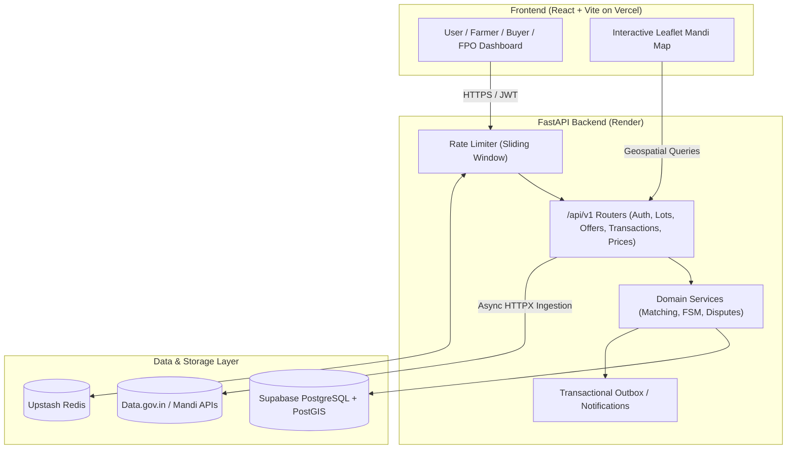

# 🌾 KrishiLink 2.0 — Comprehensive Project Overview

---

## 💡 1. The Core Idea & Purpose

### The Problem
Smallholder farmers in India often face severe market inefficiencies:
- **Middlemen exploitation:** High intermediary margins reduce farmer earnings.
- **Information asymmetry:** Farmers lack real-time access to accurate Mandi (APMC) benchmark prices.
- **Logistics & Fragmentation:** Disorganized transport and storage lead to post-harvest losses.
- **Payment Risk:** Lack of escrow or transparent contractual commitments.

### The Solution
**KrishiLink** is a direct B2B agricultural trade & price intelligence platform connecting **Farmers**, **Farmer Producer Organizations (FPOs)**, and verified **Institutional Buyers** (traders, exporters, retailers).

Key capabilities:
1. **Direct Marketplace & Matching:** Post harvest lots, search buyer demand, and automatically match supply with proximity-aware geospatial queries.
2. **Contractual Escrow & Negotiations:** Formalize offers, counter-offers, and transparent milestone-driven order fulfillment.
3. **Price Intelligence:** Live Mandi benchmark pricing with 7-day trend analytics and geospatial mapping.
4. **Dispute & Support Resolution:** Formal dispute lifecycles with evidence uploads and admin arbitration.

---

## 🛠️ 2. Technology Stack

### 🖥️ Frontend
- **Framework:** [React 19](https://react.dev/) + [Vite](https://vite.dev/)
- **Routing & State:** React Router DOM, Custom Context Hooks (`useAuth`, `useLanguage`)
- **Styling & UI:** [Tailwind CSS v4](https://tailwindcss.com/), Lucide Icons
- **Geospatial & Mapping:** Leaflet / React-Leaflet + OpenStreetMap tiles
- **HTTP Client:** Native Fetch / Axios wrapped in strict API interceptor pipelines
- **Quality & Bundling:** Oxlint, Vite production bundler

### ⚙️ Backend & API
- **Framework:** [FastAPI](https://fastapi.tiangolo.com/) (Python 3.13)
- **ASGI Server:** Uvicorn (Multi-worker production configuration)
- **Validation & Schemas:** [Pydantic v2](https://docs.pydantic.dev/)
- **Authentication & Security:** JWT tokens (OAuth2 password flow), Argon2 / Passlib password hashing, Sliding-window Rate Limiting
- **Async Client:** [HTTPX](https://www.python-httpx.org/) (for asynchronous external government Mandi price ingestion)
- **Observability:** OpenTelemetry instrumentation, Structured JSON logs with `X-Request-ID` correlation

### 🗄️ Database & Caching
- **Primary Database:** PostgreSQL with [PostGIS](https://postgis.net/) extension (`GEOGRAPHY(POINT, 4326)` for geospatial radius searches)
- **ORM & Migrations:** [SQLAlchemy 2.0](https://www.sqlalchemy.org/) + [Alembic](https://alembic.sqlalchemy.org/)
- **Caching & Throttling:** [Redis](https://redis.io/) (Upstash in production, local Redis in dev) with in-memory fallback
- **Test Database:** SQLite dual-compatibility engine with custom UUID bind processors

### ☁️ Cloud Infrastructure & Deployment
- **Frontend Hosting:** [Vercel](https://vercel.com/)
- **Backend Hosting:** [Render](https://render.com/) (Dockerized Container)
- **Cloud Database:** [Supabase](https://supabase.com/) (PostgreSQL 15+ with PostGIS & Supavisor IPv4 Connection Pooler)
- **Cloud Redis:** [Upstash](https://upstash.com/) (Serverless Redis over TLS)
- **Storage Adapter:** AWS S3 / Cloudflare R2 compatibility for dispute media & crop verification

---

## 🔄 3. System Architecture & End-to-End Workflow

---

## 📦 4. Core Modules & How They Work

### 1. Authentication & RBAC (`app/modules/auth`, `app/modules/users`)
- **Roles:** `FARMER`, `BUYER`, `FPO`, `ADMIN`.
- Passwords hashed using industry-standard Argon2.
- Session managed via short-lived JWT access tokens and secure reset tokens.

### 2. Produce Lots & Matching Engine (`app/modules/lots`, `app/modules/matching`)
- Farmers list produce with quantity, asking price per quintal, harvest dates, and GPS coordinates.
- Matching engine runs PostGIS spatial distance calculations (`ST_DWithin` / spherical distance) to pair nearby farmers with active buyer requests, eliminating N+1 query overhead.

### 3. Negotiation & Escrow FSM (`app/modules/offers`, `app/modules/transactions`)
- **Finite State Machine (FSM):**
  `PENDING` -> `ACCEPTED / COUNTERED` -> `ESCROW_LOCKED` -> `DISPATCHED` -> `DELIVERED` -> `COMPLETED`
- Uses database row-level locking (`with_for_update`) to prevent double-allocation of produce lots during simultaneous buyer checkouts.

### 4. Real-time Market Intelligence (`app/modules/prices`, `app/modules/markets`)
- Fetches real daily APMC mandi market arrival rates across major vegetable and crop varieties.
- Computes truthful 7-day price trends (moving averages, modal price deviations) rather than synthetic/hallucinated predictions.

### 5. Disputes & Grievances (`app/modules/disputes`)
- Strict multi-step dispute arbitration lifecycle (`OPEN` -> `UNDER_REVIEW` -> `RESOLVED` -> `CLOSED`).
- Secured with IDOR prevention (Insecure Direct Object References) ensuring only transaction participants or admins can view evidence files.

### 6. Event-Driven Notifications & Outbox (`app/modules/notifications`)
- Mutations emit persistent event records to a `notification_outbox` table within the same ACID database transaction, preventing message loss during network drops.

---

## 🧪 5. Testing & Verification Setup

- **Automated Tests:** 78 automated unit, integration, and multi-role journey tests passing at 100% via `pytest`.
- **Testing Scope:** Covers full multi-role user journeys:
  - *Farmer:* Register -> List lot -> Match discovery -> File dispute.
  - *Buyer:* Search -> Filter -> Counter-offer -> Escrow release.
  - *Admin:* Health metrics inspection -> Dispute arbitration.
